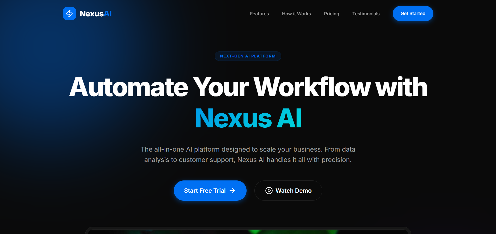

# Nexus AI 🚀

A modern **AI SaaS landing page** designed to showcase a fictional AI automation platform with a focus on **high-converting UI, interactive elements, and premium visual design**.

Built using **HTML, CSS, and Vanilla JavaScript** with advanced UI effects and smooth user interactions.

---

## 🌐 Live Demo

https://nexus-ai.vercel.app

---

## 📸 Preview



---

## 💡 Concept

Nexus AI simulates a next-generation AI platform that helps users automate workflows, generate content, and boost productivity.

The goal of this project was to **replicate real-world SaaS landing page design patterns** used by modern startups.

---

## ✨ Key Features

* **Modern SaaS UI:** Clean, premium layout inspired by real AI products  
* **Glassmorphism Design:** Frosted navigation bar and UI elements  
* **Gradient Lighting Effects:** Subtle glow and depth for a high-end feel  
* **Interactive AI Simulation:** Prompt-based UI that mimics AI responses  
* **Floating Stats UI:** Animated data cards to enhance realism  
* **Pricing Toggle:** Monthly / Yearly switch with dynamic UI updates  
* **Scroll Animations:** Powered by Intersection Observer API  
* **Responsive Design:** Optimized for all devices  
* **Dynamic UI Elements:** Navigation, mobile menu, and footer updates  

---

## 🎨 UI/UX Highlights

* Smooth hover and micro-interactions  
* Animated hero section with depth effects  
* Clean spacing and typography for readability  
* Real product-like dashboard preview  
* Focus on visual hierarchy and conversion flow  

---

## 🛠 Tech Stack

* **HTML5**
* **CSS3 (Advanced UI + Animations)**
* **Vanilla JavaScript**
* **Intersection Observer API**
* **Lucide Icons**

---

## 🚀 Getting Started

```bash
git clone https://github.com/Afsal-Palliyal/nexus-ai.git
cd nexus-ai

Open in browser: Open index.html
